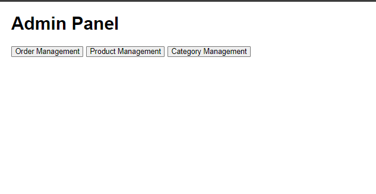
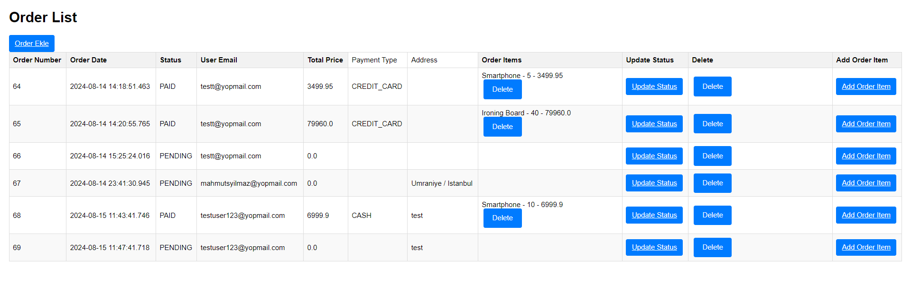
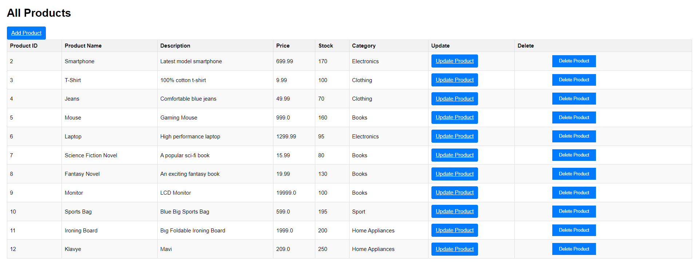
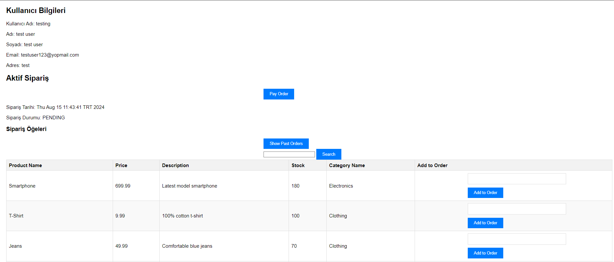
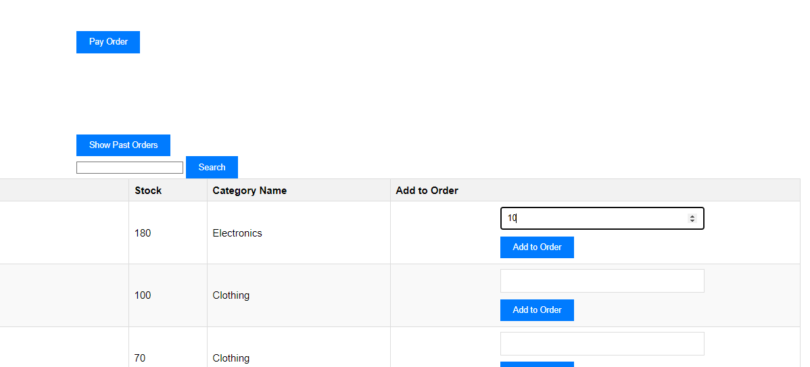
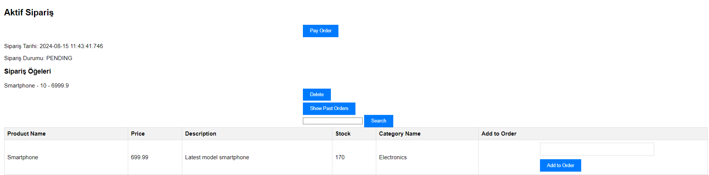
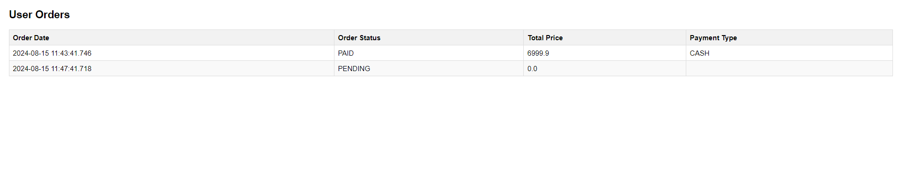

# E-Commerce Platform

This project is a comprehensive e-commerce platform that allows users to browse products, add items to their cart, place orders, and make payments. Additionally, there is an admin panel for managing products, categories, and orders.

## Features

### User Registration and Login
- **User Registration**: Users can register by providing their details through the registration page. An email verification link is sent to the user's email address. The user must verify their email to complete the registration process.
- **Email Verification**: Users receive an email with a verification link. Only after clicking the link and verifying their email can they log in.
- **User Login**: Users can log in with their credentials. Successful login redirects them to their product page or the admin panel if they have admin credentials. Users who have not verified their email cannot log in.

### Product Management
- **Product Listing**: Users can view a list of all available products.
- **Product Search**: Users can search for products by name.
- **Add to Order**: Users can add products to their current order.

### Order Management
- **Place Order**: Users can place an order for products added to their cart.
- **Track Orders**: Users can view their order history and track the status of their orders.
- **Update Order Status**: Admins can update the status of orders.

### Admin Panel
- **Manage Products**: Admins can create, update, and delete products.
- **Manage Categories**: Admins can create, update, and delete product categories.
- **Manage Orders**: Admins can view and manage all orders, including updating their statuses.

### Interceptors
- **Admin Interceptor**: Custom interceptor to secure admin routes and ensure only authorized users can access admin pages.

### Payment Processing
- **Payment Form**: Users can access a payment form to pay for their orders.
- **Process Payment**: Payments are processed and the active order is cleared upon successful payment.

### User Order Management
- **View Orders**: Users can view their past orders and their statuses.
- **Delete Order Item**: Users can remove items from their order.

## Technologies Used

- **Backend**: Spring Boot, Java
- **Frontend**: Thymeleaf, HTML, CSS
- **Database**: MySQL
- **Build Tool**: Maven
- **IDE**: IntelliJ IDEA

## Setup Instructions

1. **Clone the repository**:
   ```bash
   git clone https://github.com/mahmutsyilmz/e-commerce-website.git
   cd e-commerce-website

2. **Set up the database**:

   Configure your MySQL database in `application.properties`.

3. **Build the project**:

   ```bash
   mvn clean install

4. **Run the application**:

   ```bash
   mvn spring-boot:run

5. **Access the application**:

   - **User interface**: [http://localhost:8080/api/users/register]
   - **Admin panel**: [http://localhost:8080/api/admin/home]
  
## Screenshots

Here are some screenshots showcasing the main features:

- **Admin Panel**:

  

- **Order Management**:
  

- **Update Order Status**:
    

- **Product Management**:
  

- **Products**:
  

- **Add To Order**:
  

- **After The Adding Order**:
  

- **Pay The Order**:
  

- **Show Past Order**:
  


